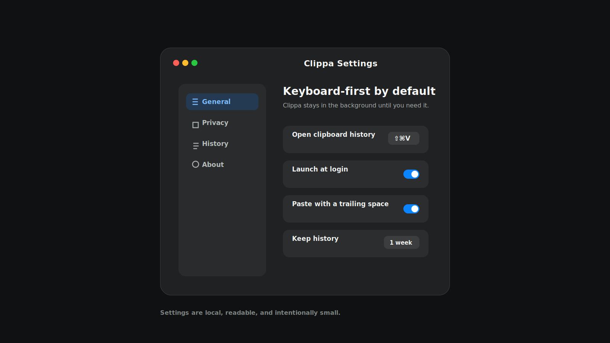
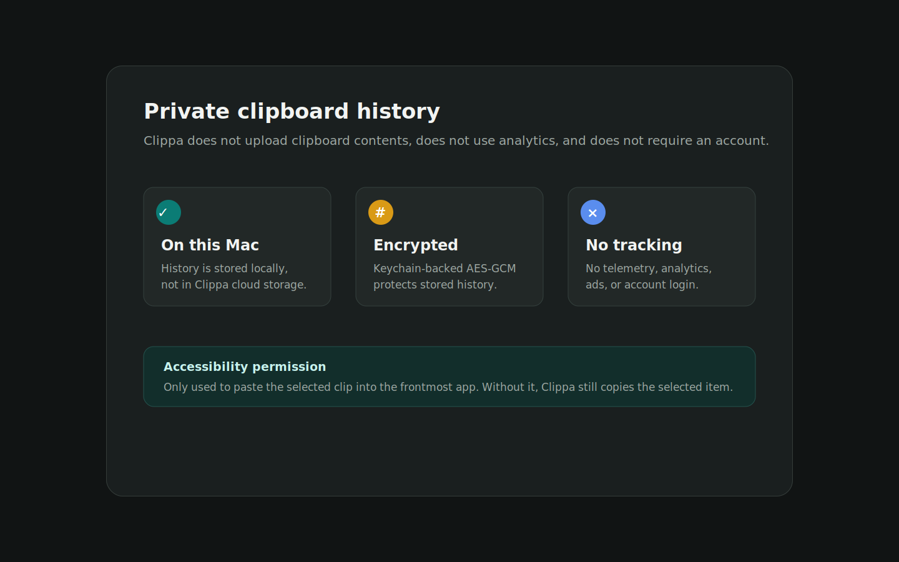

<p align="center">
  
</p>

<h1 align="center">Clippa</h1>

<p align="center">
  A fast, private macOS clipboard history app for text, links, images, and files.
</p>

<p align="center">
  <a href="https://vaniawl.github.io/Clippa/">Website</a>
  ·
  <a href="https://github.com/Vaniawl/Clippa/releases">Releases</a>
  ·
  <a href="#privacy">Privacy</a>
</p>

<p align="center">
  
</p>

## Install Clippa

Install the current GitHub build:

```bash
npx github:Vaniawl/Clippa
```

After the npm package is published, the public install command will be:

```bash
npx install-clippa
```

You can also download `outputs/Clippa.app.zip`, unzip it, move `Clippa.app` to `/Applications`, and open it.

## Highlights

- Search clipboard history from a menu-bar panel.
- Keep text, links, images, and file references.
- Pin important clips so cleanup never removes them.
- Choose your own global shortcuts.
- Paste automatically with Accessibility permission, or copy-only without it.
- Runs locally as a native SwiftUI macOS app.

## Screenshots

<p>
  
  
</p>

## Privacy

Clippa does not upload clipboard contents, does not use analytics, and does not require an account. Clipboard history is stored only on your Mac and encrypted locally with a Keychain-backed AES-GCM key.

Accessibility permission is only used to paste the selected clip into the frontmost app. Without that permission, Clippa still copies the selected item to the clipboard.

## Requirements

- macOS 26.0 or newer
- Xcode 26.6 or newer, only if you want to build from source

## Build From Source

```bash
git clone https://github.com/Vaniawl/Clippa.git
cd Clippa
xcodebuild -project Clippa.xcodeproj -scheme Clippa -destination 'platform=macOS' test
SMOKE_LAUNCH=1 ./scripts/release.sh
```

The packaged app is written to:

```bash
outputs/Clippa.app.zip
```

## npm Publish

The npm installer package is prepared as `install-clippa`. Publishing requires an authenticated npm session:

```bash
npm adduser
npm publish --access public
```

## Update From Git

For an existing checkout:

```bash
git pull origin main
```

## Production Notes

- Bundle identifier: `com.ivandovhosheia.Clippa`
- Version: `1.0.0`
- Release builds use hardened runtime.
- Pinned items are retained until deleted; unpinned history is limited to 100 active items.
