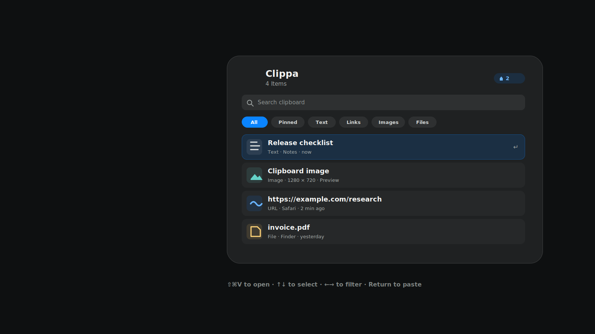

<p align="center">
  
</p>

<h1 align="center">Clippa</h1>

<p align="center">
  Private, keyboard-first clipboard history for macOS.
</p>

<p align="center">
  <a href="https://github.com/Vaniawl/Clippa/releases/latest"></a>
  
  <a href="LICENSE"></a>
</p>

<p align="center">
  <a href="https://vaniawl.github.io/Clippa/">Website</a>
  ·
  <a href="https://github.com/Vaniawl/Clippa/releases">Releases</a>
  ·
  <a href="#privacy">Privacy</a>
</p>

<p align="center">
  
</p>

## Install Clippa

Install the current version directly from GitHub:

```bash
npx --yes github:Vaniawl/Clippa#main
```

After it opens, grant Accessibility access when macOS asks. Clippa needs that permission only to paste the selected item into the app where your cursor is already active.

Useful installer options:

```bash
npx --yes github:Vaniawl/Clippa#main --no-open
npx --yes github:Vaniawl/Clippa#main --install-dir ~/Applications
```

You can also download `Clippa.app.zip` from the latest GitHub release, unzip it, move `Clippa.app` to `/Applications`, and open it.

## How It Works

- Runs quietly in the background as a menu-bar app.
- Press `Command-Shift-V` anywhere to open clipboard history.
- Use `Up` / `Down` to choose a clipboard item.
- Use `Left` / `Right` to switch between clipboard filters.
- Press `Command-P` to pin or unpin the selected item.
- Press `Enter` or click an item to paste it.
- Keeps the newest copied item at the top and shows pinned items only in the Pinned filter.
- Optionally adds one space after pasted text or links.
- Use the context menu to copy, pin, delete, open, or Quick Look an item.
- Drag text, links, images, and files directly into other apps.
- Press `Esc` or click outside the panel to close it.
- Stores recent text, links, images, and file references locally on your Mac.
- Supports configurable retention, history limits, excluded apps, and Launch at Login.

## Privacy

Clippa does not upload clipboard contents, does not use analytics, and does not require an account. Clipboard history is stored only on your Mac and encrypted locally with a per-user AES-GCM key file in Application Support. Clippa does not read or write Keychain items at startup, so locally signed reinstall builds do not trigger Keychain password prompts.

Accessibility permission is only used to restore focus and paste the selected clip into the app that was active before Clippa opened. If automatic paste is unavailable, Clippa keeps the item on the system clipboard and shows a direct link to the required permission.

## Requirements

- macOS 26.0 or newer
- Xcode 26.6 or newer, only if you want to build from source

## Build From Source

```bash
git clone https://github.com/Vaniawl/Clippa.git
cd Clippa
xcodebuild -project Clippa.xcodeproj -scheme Clippa -destination 'platform=macOS' test
SMOKE_LAUNCH=1 ./scripts/release.sh
```

The packaged app is written to:

```bash
outputs/Clippa.app.zip
```

## Update From Git

For an existing checkout:

```bash
git pull origin main
```

## Production Notes

- Bundle identifier: `com.ivandovhosheia.Clippa`
- Version: `1.0.9`
- Release builds use hardened runtime.
- History retention and item limits are configurable; the default is 100 items for one week.
