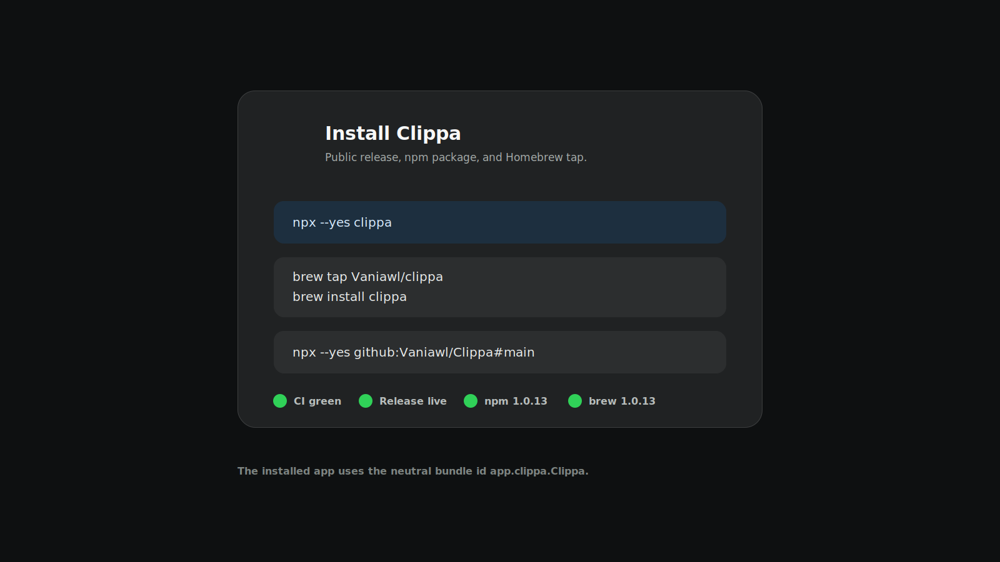

<p align="center">
  
</p>

<h1 align="center">Clippa</h1>

<p align="center">
  <strong>Private clipboard history for macOS.</strong><br>
  Open with <code>Command-Shift-V</code>, pick an item, press <code>Return</code>, and keep working.
</p>

<p align="center">
  <a href="https://github.com/Vaniawl/Clippa/actions/workflows/ci.yml"></a>
  <a href="https://www.npmjs.com/package/clippa"></a>
  <a href="https://github.com/Vaniawl/Clippa/releases/latest"></a>
  
  <a href="LICENSE"></a>
</p>

<p align="center">
  <a href="https://vaniawl.github.io/Clippa/">Website</a>
  ·
  <a href="https://www.npmjs.com/package/clippa">npm</a>
  ·
  <a href="https://github.com/Vaniawl/Clippa/releases">Releases</a>
  ·
  <a href="#privacy">Privacy</a>
  ·
  <a href="CONTRIBUTING.md">Contributing</a>
</p>

<p align="center">
  
</p>

## Install

Run the installer with npm:

```bash
npx --yes clippa
```

Or install with Homebrew:

```bash
brew tap Vaniawl/clippa
brew install clippa
```

Update later with:

```bash
brew update
brew upgrade clippa
```

You can also install the current `main` build directly from GitHub:

```bash
npx --yes github:Vaniawl/Clippa#main
```

After it opens, grant Accessibility access when macOS asks. Clippa needs that permission only to paste the selected item into the app where your cursor is already active.

Useful installer options:

```bash
npx --yes github:Vaniawl/Clippa#main --no-open
npx --yes github:Vaniawl/Clippa#main --install-dir ~/Applications
```

You can also download `Clippa.app.zip` from the latest GitHub release, unzip it, move `Clippa.app` to `/Applications`, and open it.

## Screenshots

| Clipboard panel | Settings |
| --- | --- |
|  |  |

| Privacy | Install and release |
| --- | --- |
|  |  |

## What It Does

Clippa runs quietly in the menu bar. Press `Command-Shift-V` in any app, select a clipboard item with the keyboard or mouse, then press `Return` or click to paste it back into the app you were using.

Core workflow:

- `Command-Shift-V` opens clipboard history.
- `Up` / `Down` selects items.
- `Left` / `Right` switches filters.
- `Return` or click pastes the selected item.
- `Esc` closes the panel.

Useful details:

- Keeps recent text, links, images, and file references.
- Newest copied item stays at the top.
- Pinned items stay available separately.
- Optional trailing space for pasted text and links.
- Context menu supports copy, pin, delete, open, and Quick Look.
- History retention, item limits, excluded apps, and Launch at Login are configurable.

## iPhone Companion

The repo also includes an early `Clippa iOS` target. It is a separate iPhone companion app, shaped around iOS clipboard limits:

- Open Clippa on iPhone.
- Tap **Save current clipboard** to store the text, link, or image that is currently copied.
- Tap any saved clip to copy it back to the system clipboard.
- Return to the previous app and paste normally.

iOS does not allow third-party apps to monitor the clipboard in the background, show a global floating paste window, or paste directly into other apps. This companion app keeps the flow explicit and local.

## Privacy

Clippa does not upload clipboard contents, does not use analytics, and does not require an account.

Privacy behavior:

- Clipboard history stays on your Mac.
- Stored history is encrypted locally with AES-GCM.
- No telemetry, advertising SDKs, account system, or cloud clipboard database.
- Common password managers are excluded by default.
- Additional apps can be added to the excluded-apps list.

Accessibility permission is only used to restore focus and paste the selected clip into the app that was active before Clippa opened. If automatic paste is unavailable, Clippa keeps the item on the system clipboard and shows a direct link to the required permission.

## Verification

The current public release is `1.0.12`.

| Check | Status |
| --- | --- |
| GitHub Actions CI | Passing |
| Local Swift tests | 30/30 passing |
| Local iOS companion tests | 6/6 passing |
| Release build | Passing |
| Smoke launch | Passing |
| GitHub release | `v1.0.12` live |
| npm package | `clippa@1.0.12` |
| Homebrew cask | `clippa 1.0.12` |
| Bundle identifier | `app.clippa.Clippa` |

Useful verification commands:

```bash
npm view clippa version
npx --yes clippa --version
brew info clippa
```

## Requirements

- macOS 26.0 or newer
- Xcode 26.6 or newer, only if you want to build from source

## Build From Source

```bash
git clone https://github.com/Vaniawl/Clippa.git
cd Clippa
xcodebuild -project Clippa.xcodeproj -scheme Clippa -destination 'platform=macOS' test
xcodebuild -project Clippa.xcodeproj -scheme 'Clippa iOS' -destination 'platform=iOS Simulator,name=iPhone 17 Pro' CODE_SIGNING_ALLOWED=NO test
SMOKE_LAUNCH=1 ./scripts/release.sh
```

The packaged app is written to:

```bash
outputs/Clippa.app.zip
```

## Update From Git

For an existing checkout:

```bash
git pull origin main
```

## Production Notes

- Bundle identifier: `app.clippa.Clippa`
- Version: `1.0.12`
- Release builds use hardened runtime.
- History retention and item limits are configurable; the default is 100 items for one week.
