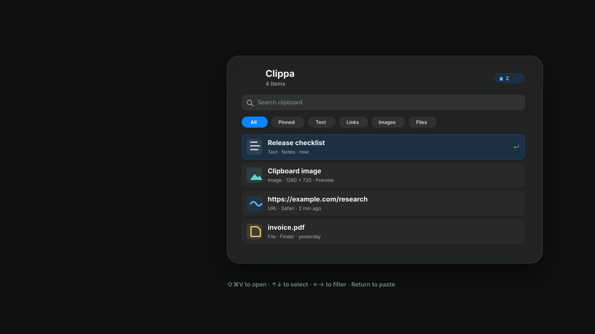
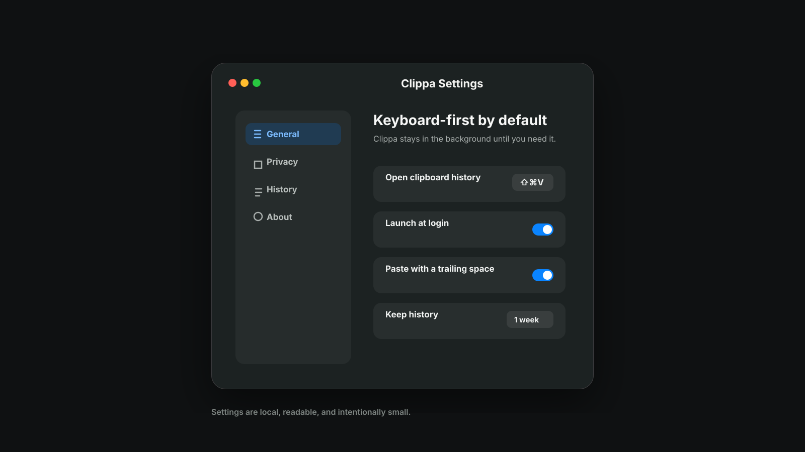
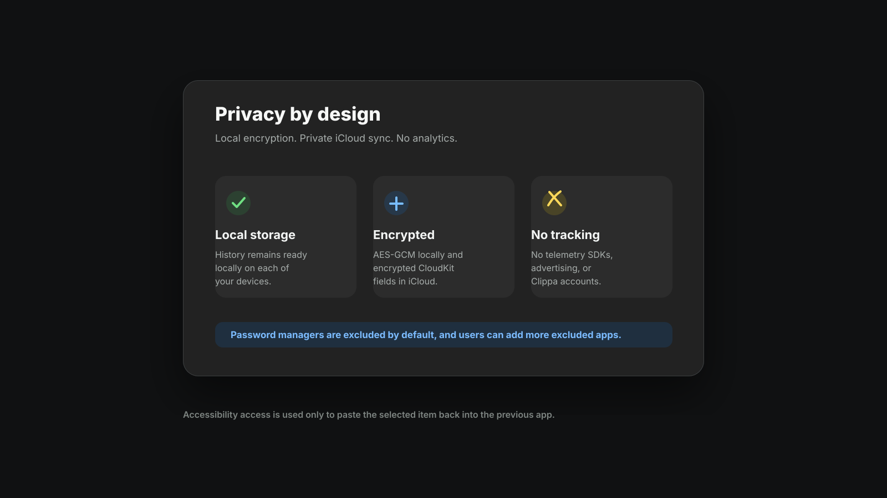
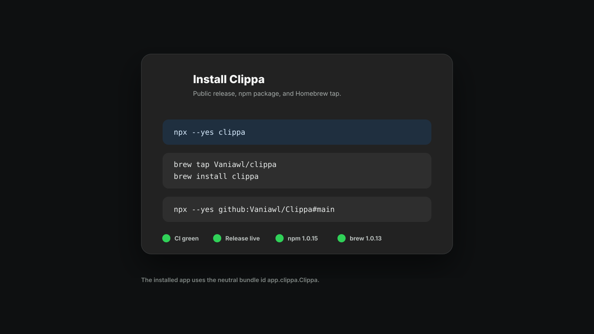

<p align="center">
  
</p>

<h1 align="center">Clippa</h1>

<p align="center">
  <strong>Private clipboard history for macOS.</strong><br>
  Open with <code>Command-Shift-V</code> (or your chosen shortcut), pick an item, press <code>Return</code>, and keep working.
</p>

<p align="center">
  <a href="https://github.com/Vaniawl/Clippa/actions/workflows/ci.yml"></a>
  <a href="https://www.npmjs.com/package/clippa"></a>
  <a href="https://github.com/Vaniawl/Clippa/releases/latest"></a>
  
  <a href="LICENSE"></a>
</p>

<p align="center">
  <a href="https://vaniawl.github.io/Clippa/">Website</a>
  ·
  <a href="https://www.npmjs.com/package/clippa">npm</a>
  ·
  <a href="https://github.com/Vaniawl/Clippa/releases">Releases</a>
  ·
  <a href="#privacy">Privacy</a>
  ·
  <a href="CONTRIBUTING.md">Contributing</a>
</p>

<p align="center">
  
</p>

## Install

Run the installer with npm:

```bash
npx --yes clippa
```

Or install with Homebrew:

```bash
brew tap Vaniawl/clippa
brew install clippa
```

Update later with:

```bash
brew update
brew upgrade clippa
```

You can also install the current `main` build directly from GitHub:

```bash
npx --yes github:Vaniawl/Clippa#main
```

After it opens, grant Accessibility access when macOS asks. Clippa needs that permission only to paste the selected item into the app where your cursor is already active.

Useful installer options:

```bash
npx --yes github:Vaniawl/Clippa#main --no-open
npx --yes github:Vaniawl/Clippa#main --install-dir ~/Applications
```

You can also download `Clippa.app.zip` from the latest GitHub release, unzip it, move `Clippa.app` to `/Applications`, and open it.

## Screenshots

| Clipboard panel | Settings |
| --- | --- |
|  |  |

| Privacy | Install and release |
| --- | --- |
|  |  |

## What It Does

Clippa runs quietly in the menu bar. Press `Command-Shift-V` in any app, select a clipboard
item with the keyboard or a single click, then press `Return` or double-click to paste it
back into the destination shown in the panel header.

Core workflow:

- `Command-Shift-V` opens clipboard history.
- The global shortcut can be recorded in Settings; registration status and a menu-bar
  Open History fallback are always visible.
- `Up` / `Down` selects items.
- `Left` / `Right` switches filters.
- `Return` or double-click pastes the selected item.
- `Command-Return` pastes text or links as plain text.
- `Esc` closes the panel.

Useful details:

- Keeps recent text, links, images, and file references.
- Newest copied item stays at the top.
- Pinned items remain visible at the top of All and in their dedicated filter.
- A compact footer keeps the primary keyboard commands visible.
- Delete and clear actions show a five-second Undo banner; `Command-Z` remains available
  after the banner closes.
- Optional trailing space for pasted text and links.
- Context menu supports copy, pin, delete, open, Quick Look, and image text extraction.
- Search supports plain text plus tokens such as `kind:text`, `type:link`, `from:safari`, `is:pinned`, `today`, and `yesterday`.
- The search help button lists tokens and the plain-text paste shortcut in context.
- History saving can be paused temporarily from the menu bar or Privacy settings.
- Link tracking cleanup removes common `utm_*`, `fbclid`, `gclid`, and similar parameters.
- Pinned clips can be exported and imported as local JSON.
- History retention, item limits, on-disk budget, excluded apps, and Launch at Login are configurable.

## iPhone Companion

The repo also includes a `Clippa iOS` target. It is a separate iPhone companion app, shaped around iOS clipboard limits:

- Open Clippa on iPhone.
- Copy text, a link, or an image in another app, then return to Clippa. The app saves the current iPhone clipboard automatically while it is active.
- Tap any saved clip to copy it back to the system clipboard.
- Use search, filters, swipe actions, pinned clips, preview, and local settings from the iPhone app.
- Return to the previous app and paste normally.
- Use Shortcuts or Siri actions to save the current clipboard, copy the latest saved clip, or open Clippa.

iOS may ask once before allowing automatic clipboard reads. It does not allow third-party apps to monitor the clipboard in the background, show a global floating paste window, or paste directly into other apps. This companion app keeps the flow explicit and local.

## Privacy

Clippa does not upload clipboard contents, does not use analytics, and does not require an account.

Privacy behavior:

- Clipboard history stays on your Mac.
- Stored macOS history is encrypted locally with AES-GCM; its 256-bit key is stored in
  Keychain, separately from the encrypted manifest and image blobs.
- No telemetry, advertising SDKs, account system, or cloud clipboard database.
- Common password managers are excluded by default.
- Additional apps can be added to the excluded-apps list.

Accessibility permission is only used to restore focus and paste the selected clip into the app that was active before Clippa opened. If automatic paste is unavailable, Clippa keeps the item on the system clipboard and shows a direct link to the required permission.

## Verification

The current public release is `1.0.13`.

| Check | Status |
| --- | --- |
| GitHub Actions CI | Passing |
| Local Swift tests | 43/43 passing |
| Local iOS companion tests | 13/13 passing |
| Unsigned Release build | Passing |
| Developer ID + notarization | Prepared; credentials-dependent and not run in this checkout |
| Gatekeeper assessment of current 1.0.13 ZIP | Fails (legacy ad-hoc artifact; replacement release required) |
| GitHub release | `v1.0.13` live |
| npm package | `clippa@1.0.13` prepared; publish requires npm 2FA |
| Homebrew cask | `clippa 1.0.13` |
| Bundle identifier | `app.clippa.Clippa` |

Useful verification commands:

```bash
npm view clippa version
npx --yes clippa --version
brew info clippa
```

## Requirements

- macOS 26.0 or newer
- Xcode 26.6 or newer, only if you want to build from source

## Build From Source

```bash
git clone https://github.com/Vaniawl/Clippa.git
cd Clippa
xcodebuild -project Clippa.xcodeproj -scheme Clippa -destination 'platform=macOS' test
xcodebuild -project Clippa.xcodeproj -scheme 'Clippa iOS' -destination 'platform=iOS Simulator,name=iPhone 17 Pro' CODE_SIGNING_ALLOWED=NO test
DEVELOPER_ID_APPLICATION="Developer ID Application: …" \
APPLE_TEAM_ID="…" \
APPLE_NOTARY_KEYCHAIN_PROFILE="clippa-notary" \
SMOKE_LAUNCH=1 ./scripts/release.sh
```

The packaged app is written to:

```bash
outputs/Clippa.app.zip
```

## Update From Git

For an existing checkout:

```bash
git pull origin main
```

## Production Notes

- Bundle identifier: `app.clippa.Clippa`
- Version: `1.0.13`
- Production release packaging fails closed unless Developer ID signing and notarization
  credentials are supplied. It verifies the hardened runtime, notarizes, staples,
  assesses with Gatekeeper, reopens the final ZIP, and writes a SHA-256 checksum.
- History retention and item limits are configurable; the default is 100 items for one week.
